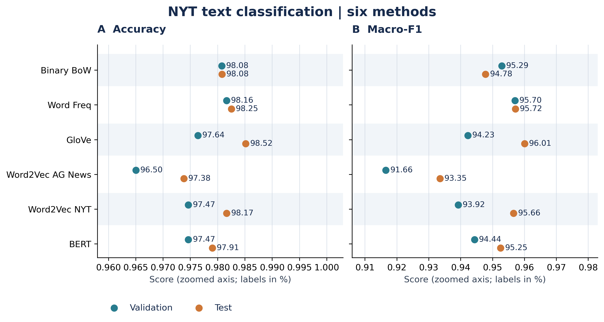

# 作业一 文本分类实现与运行说明

本项目完成作业指定的六组实验：Binary BoW、Word Frequency、GloVe、AG News Word2Vec、NYT Word2Vec 和 BERT。六组均已实际运行，使用相同 NYT 划分。正式报告为 [PDF](report/report.pdf)，另有 [可编辑 Word](report/report.docx) 和 [Markdown](report/report.md)。

## 作业要求与提交

依据《作业一要求.docx》，应提交 **PDF 实验报告、完整代码、代码运行说明**，提交方式为包含全部材料的 **GitHub 链接**。截止时间为 **10 月 12 日上午 11:55**，原文未注明年份，以课程通知为准。

Task 1 明确要求两种方法并列出两个定义，另有一句“三种方法”的不一致表述；本项目完成 Binary BoW 和 Word Frequency，不包含 TF-IDF。Task 2 完成三组 100 维词向量平均表示加 Logistic Regression；Task 3 使用指定 BERT，max_length=64，训练 3 epochs。

提交前请完成：

1. 填写 Word 报告首页姓名、学号和班级，重新导出 PDF，确保内容一致。
2. 将 `src/`、`tests/`、`requirements.txt`、`README.md`、`report/` 和当前 `results/` 纳入仓库；Markdown 图表依赖 `results/` 中图片，保留相对路径。
3. 按下文说明提供或准备课程数据和 GloVe。原文未明确要求提交模型权重，`models/` 和 `data/glove/` 默认被 Git 忽略，本地保留用于复查及预测；有额外课程要求时另行提供。
4. 检查 GitHub 上报告、代码与说明可访问，再到课程平台提交链接。本项目不会自动上传或代交。

作业要求独立完成，请本人理解并核对代码与分析，遵守课程对辅助工具的规定。

## 当前结果

| 方法 | Test Accuracy | Test Macro-F1 |
| --- | ---: | ---: |
| Binary BoW | 0.9808 | 0.9478 |
| Word Frequency | 0.9825 | 0.9572 |
| GloVe | 0.9852 | 0.9601 |
| Word2Vec AG News | 0.9738 | 0.9335 |
| Word2Vec NYT | 0.9817 | 0.9566 |
| BERT | 0.9791 | 0.9525 |



GloVe 在本次测试集上最好；结果来自单次固定划分，不代表统计显著性或普遍最优结论。

## 文件结构

```text
hw1/
├── 作业一要求.docx                 # 课程要求原文
├── README.md                     # 运行说明与提交清单
├── requirements.txt              # 本地实验依赖
├── .gitignore                    # 忽略环境、权重、缓存与临时文件
├── data/
│   ├── nyt.csv                   # text、label 列
│   ├── ag.csv                    # text 列
│   └── glove/glove.6B.100d.txt    # 下载的 100 维 GloVe
├── src/
│   ├── __init__.py               # 包入口
│   ├── utils.py                  # 去重、划分、分词、指标、LR
│   ├── embeddings.py             # 有效词向量平均与覆盖率
│   ├── experiment.py             # 模型、预测、日志和结果保存
│   ├── check_environment.py       # 依赖与数据预检查
│   ├── task1_bow.py               # 两种词袋模型
│   ├── task2_glove.py             # GloVe 加 LR
│   ├── task2_word2vec.py          # AG 或 NYT Word2Vec 加 LR
│   ├── task3_bert.py              # BERT 微调
│   ├── predict.py                # 已保存模型的单条预测
│   ├── aggregate_results.py      # 汇总六组结果
│   └── plot_results.py           # 生成四类报告图表
├── tests/test_pipeline.py        # 数据协议与流程测试
├── models/<实验>/<run_id>/        # 模型及元数据
├── results/
│   ├── task*.json                # 最近一次成功运行的结果索引
│   ├── summary.csv               # 六组汇总
│   ├── splits/<split_id>.json    # 原始行号、类别分布和数据哈希
│   ├── details/<实验>/<run_id>/   # 预测、错误、分类报告及环境
│   ├── comparison_chart.*        # 验证与测试指标
│   ├── class_f1_chart.*          # 分类别 F1
│   ├── confusion_matrices.*      # 六组混淆矩阵
│   └── bert_training_curve.*     # BERT loss 与验证曲线
└── report/
    ├── report.pdf               # 正式提交版
    ├── report.docx              # 可编辑版
    └── report.md                # 文本版
```

图表各提供 300 dpi PNG、矢量 PDF、SVG。`comparison_chart_metadata.json` 记录运行 ID 与协议。结果 JSON 中的模型、明细和划分路径相对项目根目录，迁移时保持结构。

## 环境和数据准备

以下 PowerShell 命令均在项目根目录执行，每行单独运行。支持 Python 3.11–3.13，本地实际训练使用 3.13.9。

```powershell
# 首次建立环境；已有 .venv 时跳过创建和重复安装
python -m venv .venv
$py = ".\.venv\Scripts\python.exe"
& $py -m pip install -r requirements.txt
& $py -c "import sys; print(sys.executable)"
```

新开 PowerShell 后重新设置 `$py`。直接调用虚拟环境 Python 不要求激活，提示符没有 `(.venv)` 也可正常使用。Linux 环境可用 `python3 -m venv .venv`，后续使用 `.venv/bin/python` 执行同样模块。

将课程 `nyt.csv` 和 `ag.csv` 放在 `data/`。从作业提供的 [GloVe 下载地址](http://nlp.stanford.edu/data/glove.6B.zip) 下载解压，把 `glove.6B.100d.txt` 放到 `data/glove/`。本实验不使用其他维度。

本地实际版本：Python 3.13.9、NumPy 2.3.5、pandas 2.3.3、scikit-learn 1.7.2、gensim 4.4.0。BERT 实际在 Colab 的 Python 3.13.15、PyTorch 2.11.0+cu128、Tesla T4 上运行，transformers=4.56.2、accelerate=1.10.1。完整版本见每组 `environment.json` 和 `requirements-resolved.txt`。不同平台可能有合理数值波动。

## 数据与训练协议

NYT 原始 11,519 条，先删除 72 条完全相同文本后为 11,447 条；冲突标签会报错，原 CSV 不变。去重是额外防止相同文本跨集合的处理，非作业明文要求。seed=42 随机打乱后按 80/10/10 划分为 9,157/1,144/1,146 条，采用普通随机划分，未分层抽样。

六组共用同一划分；词袋词表和 NYT Word2Vec 仅在训练集学习，AG Word2Vec 使用外部 AG 全部 90,000 条。传统方法固定小写化加正则分词，不使用 NLTK 自动回退；BERT 使用预训练 tokenizer。平均词向量按有效词出现次数计算，跳过 OOV，空文档表示为零向量。

五组传统分类器固定 C=1、lbfgs、max_iter=2000、class_weight=None；Word2Vec 为 100 维 Skip-gram、window=5、min_count=5、epochs=10、workers=1、seed=42，完整参数见结果 JSON。BERT 为长度 64、batch_size=16、学习率 2e-5、weight_decay=0.01，完整训练 3 轮。

超参数预先固定，验证集用于监测，不进行验证集网格搜索或 train+val 重训；BERT 采用第 3 轮最终模型。作业未要求调参、重训、词表截断和类别加权，报告不会声称执行了这些操作。

## 本地运行

```powershell
$py = ".\.venv\Scripts\python.exe"
& $py -X utf8 -m src.check_environment --task all
& $py -X utf8 -m src.task1_bow
& $py -X utf8 -m src.task2_glove
& $py -X utf8 -m src.task2_word2vec --corpus ag
& $py -X utf8 -m src.task2_word2vec --corpus nyt
```

Task 1 一次生成两组结果。BERT 推荐在 Colab 执行，也可本地运行：

```powershell
& $py -X utf8 -m src.check_environment --task bert
& $py -X utf8 -m src.task3_bert
```

有 CUDA 时使用 GPU，否则可使用 CPU。重新训练产生新的 run_id，完成后更新对应顶层 JSON。已有完整结果时无需重训，只运行：

```powershell
& $py -X utf8 -m src.aggregate_results --require-complete
& $py -X utf8 -m src.plot_results
```

应显示 `6/6`、各项 `complete`。协议不一致会报错，不要篡改协议 ID 强行合并。更新实验后需重新汇总、绘图并同步报告；Word/PDF 不会自动刷新。

可选测试及单条预测：

```powershell
& $py -X utf8 -m unittest discover -s tests -v
& $py -X utf8 -m src.predict --experiment task1_binary_bow --text "The team won the match."
```

实验名见 summary.csv，`--model-dir` 可指定历史模型。GloVe 预测还需要原始向量文件，BERT 使用保存的 tokenizer 和权重。

## Colab 运行 BERT 和取回结果

本地打包后将 ZIP 上传至 Google Drive 的 MyDrive 根目录：

```powershell
$upload = Join-Path $PWD "colab_task3_upload"
New-Item -ItemType Directory -Force -Path "$upload\src", "$upload\data" | Out-Null
Copy-Item .\src\*.py "$upload\src\"
Copy-Item .\data\nyt.csv "$upload\data\"
Compress-Archive -Path "$upload\*" -DestinationPath .\colab_task3.zip -Force
```

Colab 选择 GPU 运行时，下列内容放入 Python 代码单元，而非 Terminal：

```python
from google.colab import drive
drive.mount('/content/drive')
!unzip -o /content/drive/MyDrive/colab_task3.zip -d /content/hw1
%cd /content/hw1
%pip install -q transformers==4.56.2 accelerate==1.10.1
```

若要求重启会话，重启后重新挂载 Drive 并切回项目目录。保留 Colab 已有的 GPU PyTorch，不直接安装整份本地 requirements。

```python
import torch, transformers, accelerate
from transformers import Trainer, TrainingArguments
print(torch.__version__, transformers.__version__, accelerate.__version__)
assert torch.cuda.is_available(), '请切换为 GPU 运行时'
print(torch.cuda.get_device_name(0))
!python -m src.check_environment --task bert --allow-version-differences
!python -u -m src.task3_bert
```

`--allow-version-differences` 放宽版本锁定检查，仍验证导入、数据及 Trainer 接口。若提示找不到 `src`，确认当前目录为 `/content/hw1`，且存在 `src/`。命令中的下划线直接写 `_`，不要写网页转义的 `\_`。

训练成功后，根据结果 JSON 自动打包，索引必须放在 ZIP 的 `results/` 下，同时打包划分清单：

```python
from pathlib import Path
import json, zipfile, shutil
project = Path('/content/hw1')
result = json.loads((project / 'results/task3_bert.json').read_text())
archive = Path('/content/task3_colab_outputs.zip')
files = [project / 'results/task3_bert.json', project / result['split_manifest']]
for key in ('model_dir', 'details_dir'):
    files.extend(p for p in (project / result[key]).rglob('*') if p.is_file())
with zipfile.ZipFile(archive, 'w', zipfile.ZIP_DEFLATED) as z:
    for p in files:
        z.write(p, p.relative_to(project).as_posix())
shutil.copy2(archive, '/content/drive/MyDrive/task3_colab_outputs.zip')
```

下载 ZIP 后先解压至临时目录查看，再把 `models/task3_bert/`、`results/task3_bert.json`、`results/details/task3_bert/` 和匹配的划分清单合并进本地项目。保留 Task 1/2 文件。不要将 Task 3 JSON 放在根目录，也不要多套一层导出文件夹。最后本地汇总并绘图。

## 追溯信息

本次 split_id：`56048ab9d9a2225f8be9445e654bfee9b2027525b999df58c6ba578df60d27bc`。

NYT SHA256：`de12ebe7f41316b798896bf975da840e2998f82393328d375fe5456a14e9eb2d`。

BERT 使用作业指定 [google-bert/bert-base-uncased](https://huggingface.co/google-bert/bert-base-uncased)，此次 revision 为 `86b5e0934494bd15c9632b12f734a8a67f723594`。首次训练需下载预训练权重。结果中的源码哈希是训练当时版本，后续绘图和文档改进不改写训练记录。
